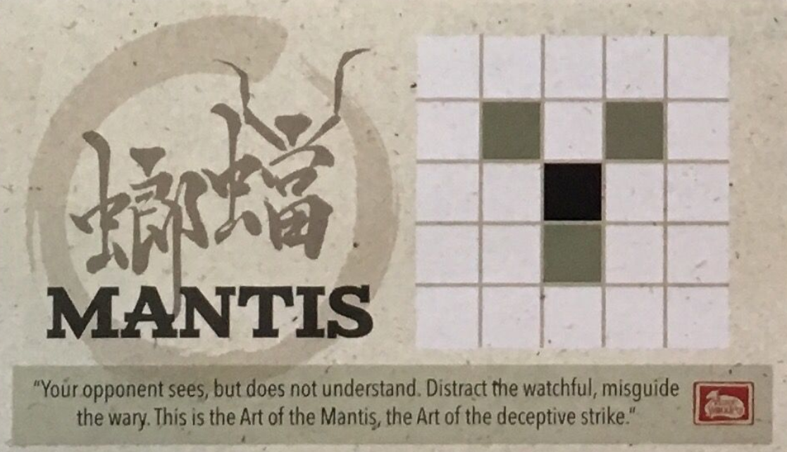

# Assignment 1 Instructions

For this assignment, we are going to be creating a program that lets you play a game of Onitama.

You will be graded on:

-   Code Correctness (based on autotests -- so make sure you DO NOT modify any method names and type signatures)
-   Code Design (having clean, simple code that avoids repetition)
-   Documentation (having proper, complete javadocs for all your code)
-   Effective use of git (making frequent commits with good log messages)

If you are unfamiliar with this game, make sure to check out these links first:

https://www.youtube.com/watch?v=IFRewjcngwU

https://www.arcanewonders.com/resources/Onitama_Rulebook.PDF

## Section 0 - Downloading JUnit 5.4 + Git Commit Message Instructions

### JUnit

One of the first errors you may see in src/test/... (let us use OnitamaTest.java for this example.),
is going to be the following:


Before you get tempted to post this on Piazza, **please follow the following instructions**.

First, you will see that there is an option: **"More actions..."**, please click that.
That will lead you to the following situation:


Next, we want you to click the option: **Add 'JUnit5.4 to classpath'**, this will
do what it says it does and lets you make test cases in `OnitamaTest.java` and `OnitamaBoardTest.java`.

After clicking that option, you will see the following popup:


Simply, press **OK**, and you are good to go.

We encourage you to make test cases for each function you will have to implement,
as it will let you know if you have bugs in your code. Testing is one of the _most important_,
things you will do as a software developer! It helps you catch bugs that you may not have caught otherwise.

### Git Messages

**Important**: In order to get **full marks** for the git usage portion of the assignment, **you must
at the very least** commit where it tells you to do so in this README, **with the EXACT same commit message, mentioned in the README**.
If you fail to follow these instructions, you will not get full marks for the git portion of the assignment.
The excuses "I forgot to commit", "I was one letter off the correct git message", "Gamestonks!!!" will not be acceptable.

With that out of the way, you are ready to start Assignment 1!

## Section 1 - Completing OnitamaBoard.java

### Task 1.1: Warmup

Complete the easy methods in OnitamaBoard.java:

-   `getDimension`, `getStyles`, `getToken`, `setToken`, `validCoordinate`

Do the following to add and commit your code:

```
cd a1-yourgithubusername/a1-code
git add OnitamaBoard.java
git commit -m "Easy OnitamaBoard methods completed"
```

### Task 1.2: constructStyles Method

Complete the method `constructStyles` in `OnitamaBoard.java`, based on the method documentation.

In a normal Onitama game, there are 16 different styles
that the players choose from. However, for simplicity we will
only be using 5 of these styles (Crab, Horse, Mantis, Rooster, and Dragon), as you can see below.

Each style represents a unique movement pattern.
In this pictures, the black square is the starting position,
and the other shaded squares are the destinations that the token
is able to reach using the respective movement style.

For example, let's consider the Crab style.

Let (r, c) represent the black square, the starting position,
where r is the row, and c is the column.

Then, we are able to reach the following positions, relative to the starting position:

-   ( r - 1 , c )
-   ( r, c - 2 )
-   ( r, c + 2 )

### Styles and their Movement Patterns:

### Crab


### Horse


### Mantis



### Rooster


### Dragon


This method will distribute the five styles that we are
using to the two players.

Normally, players would pick the styles randomly, however for this assignment,
we will distribute them consistently each time.

-   Player 1 (G1) should start with Crab and Horse.
-   Player 2 (G2) should start with Mantis and Rooster.
-   The extra style (EMPTY) should be Dragon.

This is so we can guarantee consistency when testing the program.

Git add your file and then commit your method!

```
git add OnitamaBoard.java
git commit -m "OnitamaBoard.constructStyles method completed"
```

### Task 1.3: OnitamaBoard Constructors

Complete the OnitamaBoard constructors in `OnitamaBoard.java`, based on the method
documentation.

You'll notice that we are using Java's method overloading feature
in this class. This is because we have **2 constructors!**,
they have different arguments (as required by overloading).

#### `OnitamaBoard(int size)`

For this constructor, we want to construct an empty Onitama board
with dimension **size x size**.

In addition to this, we want to place the four monks and the 1 grandmaster on opposite sides of the board
for each player. We want the board to look like the following (for `size = 5`):

```
  0 1 2 3 4
 +-+-+-+-+-+
0|x|x|X|x|x|0
 +-+-+-+-+-+
1| | | | | |1
 +-+-+-+-+-+
2| | | | | |2
 +-+-+-+-+-+
3| | | | | |3
 +-+-+-+-+-+
4|o|o|O|o|o|4
 +-+-+-+-+-+
  0 1 2 3 4
```

However, the grid should not be all hardcoded!

Remember, that there is a size parameter, so what would you do if size > 5?

#### Case: Size > 5

We require that you satisfy the following **4** conditions:

1. Even sizes raise exceptions (size must be odd)
2. The grandmaster must be in the center column
3. The monks should be placed in _all other_ columns
4. The pieces for Player X must be placed on the 0'th row.
   The pieces for Player O must be placed on the {size - 1}'th row

Keep these things in mind, when implementing the constructor!

Lastly, we want to distribute the 5 styles to the players.

Hint: You just completed a helper for this... USE IT!!

#### `OnitamaBoard(int size, char[][] board)`

For this second constructor, we want to construct a _preset_ Onitama board!

Use the given board parameter which is a **size x size** char array to initialize this OnitamaBoard.

Finally, we want to distribute the 5 styles to the players just like we did in the first constructor.

Git add your file and then commit your method!

```
git add OnitamaBoard.java
git commit -m "OnitamaBoard.constructor method completed"
```

### Task 1.4: exchangeStyle Method

Complete the method `exchangeStyle` in `OnitamaBoard.java`, based on the method
documentation.

In Onitama, when a player does a move with a certain style (in our case it will be one of Crab, Horse, Mantis, Rooster or Dragon),
they swap the style they just used with the EMPTY/Unowned style.

Remember, that each player has 2 styles, but we have a total of 5 styles,
so one of these styles will NOT have an owner (G1 or G2), rather, their owner will be EMPTY.

For this method, we want to exchange the given style with the EMPTY/Unowned style. This involves swapping their owners if possible.

Git add your file and then commit your method!

```
git add OnitamaBoard.java
git commit -m "OnitamaBoard.exchangeStyle method completed"
```

### Task 1.5: Clean up OnitamaBoard.java

Fix any issues you find, clean up your code (about 20% of your grade will be on your
code design - avoiding repeated code, using helper functions appropriately, etc.)
and then commit and push `OnitamaBoard.java`.

```
git add OnitamaBoard.java
git commit -m "OnitamaBoard.java completed"
git push
```

## Section 2 - Completing Onitama.java

### Task 2.1: Onitama Easy Methods

Complete the easy methods in `Onitama.java`:

-   `getWhoseTurn`, `otherPlayer`, `Onitama(int dimension)`, `Onitama(Player player1, Player player2, int dimension)`

The constructors should follow the 2 existing constructors, but additionally check for
the dimension.
The dimension is valid if it is odd, and greater than or equal to 5.
If it is valid, then we set it and construct a new OnitamaBoard of that dimension.

Valid Dimensions: 5, 7, 9, ...
Invalid Dimensions: 2, 3, 4, 6, 8, 10, ...

Do the following to add and commit your code:

```
git add Onitama.java
git commit -m "Easy Onitama methods completed"
```

### Task 2.2: isLegalMove method

Complete the method `isLegalMove` in `Onitama.java`, based on the method
documentation.

This method is going to be a helper for the next task.
It checks if a move with the starting position (rowO, colO) to the target position (rowD, colD)
is valid.

For a move to be valid, it must satisfy the following criteria:

1. The starting and target positions must be in the bounds of the board.
2. The token at the starting position must belong to the current player who is trying to make this move.
3. The destination position must NOT belong to the current player.
   In other words, it must be EMPTY or belong to the opposing player.

**IMPORTANT: This method does not check if the move follows a valid movement style**

Do the following to add and commit your code:

```
git add Onitama.java
git commit -m "Onitama.isLegalMove completed"
```

### Task 2.3: move Method

Complete the `move` method in `Onitama.java`, based on the method documentation and the
hints provided within the comments in the file. Try to keep your code short
and clean, using helper methods from this class and the OnitamaBoard class as appropriate.

This method takes in the starting position (rowO, colO) and the target/destination position (rowD, colD) that a player is going
to 'move to' (move from starting position to the destination position), and the name of the style that they are using (styleName).
If the move is not valid from the conditions in `isLegalMove` or the move does not follow the movement pattern from the given style (remember each style has a unique movement pattern), do nothing to the board and
return false.
If the move is valid, then we need to do the following (the order is not necessarily the same order that you should implement it in):

-   Move the token from starting position to the destination position.

-   Exchange the current player's styles.

-   Update whoseTurn to be the next player's turn.

-   return true, since this was a successful operation.

For example, if my board looked like below:

```
  0 1 2 3 4
 +-+-+-+-+-+
0| | |X| | |0
 +-+-+-+-+-+
1| |x| | | |1
 +-+-+-+-+-+
2| | | |o| |2
 +-+-+-+-+-+
3| | | |o| |3
 +-+-+-+-+-+
4| | |O| | |4
 +-+-+-+-+-+
  0 1 2 3 4
```

Then if I wanted to make a move `(rowO = 1, colO = 1, rowD = 2, colD = 3, styleName = "dragon")` with player 'X', then this would be a valid move and we would eliminate player 'O's monk at the position (2, 3) and move player 'X's monk to the position (2, 3).

The updated board would look like the following:

```
  0 1 2 3 4
 +-+-+-+-+-+
0| | |X| | |0
 +-+-+-+-+-+
1| | | | | |1
 +-+-+-+-+-+
2| | | |x| |2
 +-+-+-+-+-+
3| | | |o| |3
 +-+-+-+-+-+
4| | |O| | |4
 +-+-+-+-+-+
  0 1 2 3 4
```

Git add your file and then commit your method!

```
git add Onitama.java
git commit -m "Onitama.move completed"
```

### Task 2.4: getWinner method

Complete the `getWinner` method in `Onitama.java`, based on the method documentation. Again, keep
your code short and clean. Use the G1, G2 and EMPTY variables from the OnitamaBoard
class to access the needed character tokens.

There are 2 winning conditions:

1. A player has captured the opponent's grandmaster.
2. A player has reached the starting position of the opponent's grandmaster.

Here are 4 very basic game states to represent player victories.

**X wins by condition 1.**

```
  0 1 2 3 4
 +-+-+-+-+-+
0| | | | | |0
 +-+-+-+-+-+
1| |o| | |x|1
 +-+-+-+-+-+
2| | |X| | |2
 +-+-+-+-+-+
3| | | | |o|3
 +-+-+-+-+-+
4| | | | | |4
 +-+-+-+-+-+
  0 1 2 3 4
```

**X wins by condition 2.**

```
  0 1 2 3 4
 +-+-+-+-+-+
0| | | | | |0
 +-+-+-+-+-+
1| | | | | |1
 +-+-+-+-+-+
2| | |O|o| |2
 +-+-+-+-+-+
3| | | | | |3
 +-+-+-+-+-+
4| | |X| | |4
 +-+-+-+-+-+
  0 1 2 3 4
```

**O wins by condition 1.**

```
  0 1 2 3 4
 +-+-+-+-+-+
0| | | | | |0
 +-+-+-+-+-+
1| |x| | | |1
 +-+-+-+-+-+
2| | |O| | |2
 +-+-+-+-+-+
3| | | |x| |3
 +-+-+-+-+-+
4| |o| | | |4
 +-+-+-+-+-+
  0 1 2 3 4
```

**O wins by condition 2.**

```
  0 1 2 3 4
 +-+-+-+-+-+
0| | |O| | |0
 +-+-+-+-+-+
1| | | | | |1
 +-+-+-+-+-+
2| |x|X| | |2
 +-+-+-+-+-+
3| | | | | |3
 +-+-+-+-+-+
4| | | | | |4
 +-+-+-+-+-+
  0 1 2 3 4
```

Finally, git add Onitama, commit and push!

```
git add Onitama.java
git commit -m "Onitama.getWinner completed"
git push
```

### Task 2.5: Run Onitama.java and check the output

After the previous tasks have all been completed, you should be able to
run `Onitama.java` to run all the test code written for you in the `Onitama.main`
method. The output should be exactly the text in the file `onitamaMainOutput.txt`
included in this repository.

Fix any issues you find, clean up your code (20% of your grade will be on your
code design - avoiding repeated code, using helper functions appropriately, etc.)
and then commit and push Onitama.java.

```
git add Onitama.java
git commit -m "Onitama.java completed"
git push
```

## Section 3 - Completing Turn.java + Playing 2-Player Onitama Game

This class represents a turn in Onitama.
It contains the following attributes:

-   rowO: The origin row.
-   colO: The origin column.
-   rowD: The destination row.
-   colD: The destination column.
-   styleName: The style being used in this turn.

This section should not be too difficult considering everything previous to this. It is in preparation for Section 4, where
you are able to play a game of Onitama between two human players!

However, please make sure to keep the code clean and
concise as you are being marked for your code design!

### Task 3.1: Turn Constructor

Complete the Turn constructor in Turn.java, based on the method
documentation.

Git add your file and then commit your method!

```
git add Turn.java
git commit -m "Turn.Turn completed"
```

### Task 3.2: Attribute Getters

Add the following methods in Turn.java:

-   `getRowO`
-   `getColO`
-   `getRowD`
-   `getColD`
-   `getStyle`

Git add your file and then commit your method!

```
git add Turn.java
git commit -m "Turn getters completed"
```

### Task 3.3: toString method

Create a method to represent a `Turn` as a string.

When running `Turn.java`, you should get the same output as displayed below.

```
X: (0,0,dragon) -> (1,2)
O: (3,2,crab) -> (2,2)
X: (2,2,rooster) -> (3,1)
```

Git add your file and then commit your method!

```
git add Turn.java
git commit -m "Turn string representation completed"
```

### Task 3.4: Try out the game!

Open up the file `OnitamaControllerHumanVSHuman.java`. If you have completed all
previous tasks correctly, you should be able to run this file and play a game
of Onitama now!

To informally test things out: The file onitamaSampleInput.txt included in this repository
provides some sample input formatted as:

PLAYER makes move : (rowO,colO,styleName) -> (rowD,colD)

When you run the `OnitamaControllerHumanVSHuman` file, you will be asked for input in the following order:

1. styleName
2. rowO
3. colO
4. rowD
5. colD

The file onitamaSampleOutput.txt shows the output you should see if you enter
all these values as input in the given order. You can try inputting the provided
values and comparing the output you get to the one provided in this txt file.

## Section 4 - Completing PlayerRandom.java

Implement a `PlayerRandom` class. It should follow similarly to `PlayerHuman`, except it makes random valid moves.

### Task 4.1: getTurn method

This method should return a Turn object as defined in `Player.java`.

To do this, you will have to randomly pick a valid move that this player can make.

**Hint:** You will need an instance of the current Onitama game.

#### Tips:

-   Try to generate a list/array of _all_ valid moves this player can make.
-   Then pick a random move from this list/array.

**Note:** You will not get full marks by brute-forcing this method.

## Section 5 - Completing Onitama Controllers

These controllers should follow similarly to structure to `OnitamaControllerHumanVSHuman.java`.

They will let us play a game VS a bot which makes random moves, as well as allow a game
to run between 2 random bots.

### Task 5.1: Complete OnitamaControllerHumanVSRandom.java

This controller should have a `PlayerHuman` and a `PlayerRandom` and play a game of Onitama between them.

Git add your file and then commit your method!

```
git add OnitamaControllerHumanVSRandom.java
git commit -m "OnitamaControllerHumanVSRandom completed"
```

### Task 5.2: Complete OnitamaControllerRandomVSRandom.java

This controller should have 2 `PlayerRandom`s and play a game of Onitama between them.

Git add your file and then commit your method!

```
git add OnitamaControllerRandomVSRandom.java
git commit -m "OnitamaControllerRandomVSRandom completed"
```

**Note:** Think about design choices you can make to keep the code clean and short and **avoid repetition**.

## Section 6 - Documenting Code

### Task 6.1: Add Javadocs

Add documentation to all the following classes and methods (and any other additional ones you made):

-   `Turn`
-   `OnitamaControllerHumanVSHuman`
-   `OnitamaControllerHumanVSRandom`
-   `OnitamaControllerRandomVSRandom`
-   `Player`
-   `PlayerHuman`
-   `PlayerRandom`

Follow the conventions of writing proper Javadocs
(https://axiom.utm.utoronto.ca/~207/21s/slides/1/javadoc.html#/)

### Task 6.2: Review Your Code Design!!!

Remember that 20% of your mark is for code design. Make sure that your code is clean and concise, following all of the
principles we have discussed in class.

## Section 7 - Relax!

**Congratulations on finishing A1!!!**


Take some time to relax and do some things you enjoy, since we know that university is stressful at times (we were all in your position not too long ago).

Go play some games, watch shows/anime, read a book, draw something, or do literally anything that you love to do so you can destress!

Here's a [great video](https://www.youtube.com/watch?v=dQw4w9WgXcQ) I watch to celebrate completing assignments!
